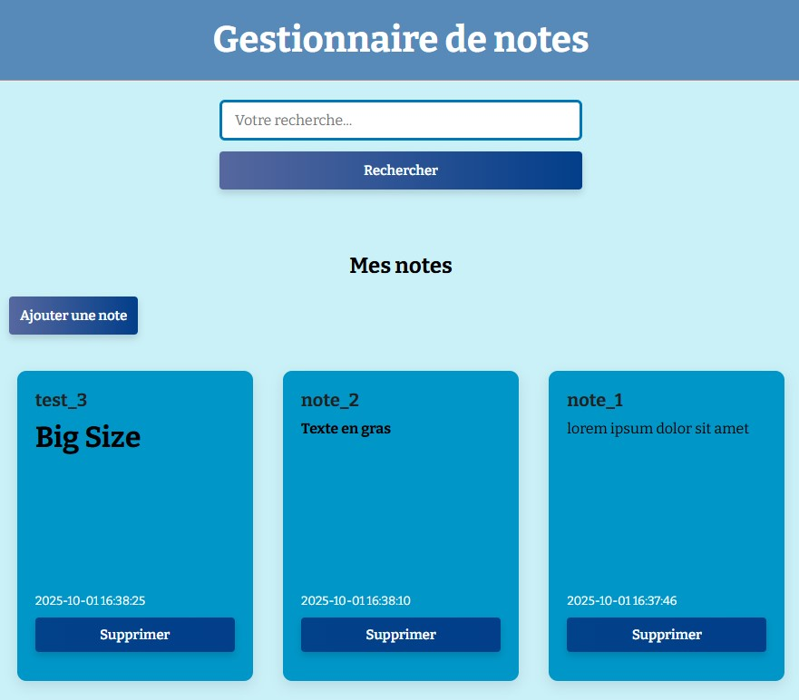

# Presentation de l'application

# Notes App

Une application simple d'édition et d'affichage de notes en Markdown, dévelopée en PHP avec le design pattern MVC (Modele-Vue-Controleur)

# Fonctionnalités
- **création, édition et suppression de notes**
- **affichage des notes avec rendu Markdown**
- **base de données locale avec SQLite**
- **structure MVC claire pour une meilleure organisation du code**

Edition et affichage de notes en markdowm

# Pré-requis

Avant d'installer ou d'exécuter l'application, assurez vous d'avoir:

- **PHP** (version 8.4 recommandé)
- **SQLite3**
- Un navigateur moderne

# Installation

1. **Cloner le dépôt GIT**

git clone https://github.com/julien-alaria/notes-app.git

2. **Lancer un serveur PHP en local (depuis le dossier du projet):** 

php -S localhost:8000

Le fichier index.php est le point d'entrée de l'application

3. **Accéder à l'application dans votre navigateur:** 

http://localhost:8000

# Architecture du projet (MVC)

L'application suit le modèle MVC en séparant:

- **models :** la logique métier et les interactions avec la base SQLite
- **views :** les templates HTML partagés (header, footer, formulaire, affichage...)
- **controllers :** la gestion des requêtes utilisateur et de la logique de navigation
- **routeur :** gestion de la navigation et des actions via les URLs

# Captures d'écran de l'application

# Arborescence du projet

notes-app/
│
├── controllers/
│   └── noteController.php
│
├── models/
│   ├── db.php
│   └── noteModel.php
│
├── views/
│   ├── footer.php
│   ├── form.php
│   ├── header.php
│   ├── notes.php
│   └── results.php
│
├── database.sqlite
├── index.php          ← Point d’entrée principal
├── routeur.php        ← Gestionnaire des routes
└── README.md

# Licence
Ce projet est open-source, sous licence MIT.

