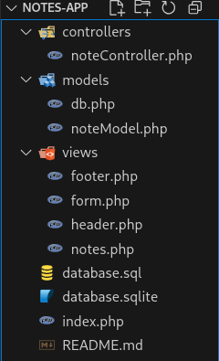

# Presentation de l'application

Edition et affichage de notes en markdowm

# Pré-requis

- **PHP** (version 7.4+ recommandé)
- **SQLite3**
- Un navigateur moderne

1. **Cloner le dépôt** (ou télécharger le dossier)

git clone https://github.com/julien-alaria/notes-app.git

# Captures d'écran de l'application

# Arborescence du projet

# Nom de l'auteur
## julien

